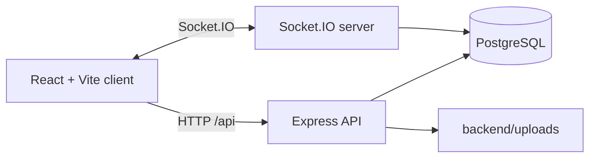
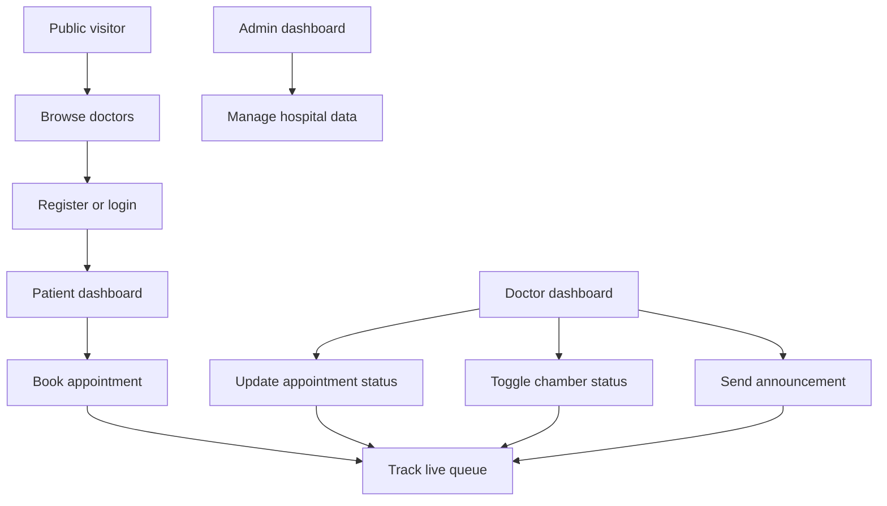

# Hospital Management System

[](#frontend)
[](#backend)
[](#realtime-features)

A full-stack hospital management web app for patients, doctors, and admins. Patients can find doctors, book appointments, track their queue in real time, and manage test results. Doctors can manage today's appointment flow, chamber status, and patient announcements. Admins can manage doctors, categories, appointments, gallery images, offers, patients, and health quotes.

## Table Of Contents

- [Project Preview](#project-preview)
- [Core Features](#core-features)
- [Tech Stack](#tech-stack)
- [Architecture](#architecture)
- [Quick Start](#quick-start)
- [Demo Accounts](#demo-accounts)
- [Environment Variables](#environment-variables)
- [Project Structure](#project-structure)
- [Available Scripts](#available-scripts)
- [API Overview](#api-overview)
- [Realtime Features](#realtime-features)
- [Database Notes](#database-notes)
- [Troubleshooting](#troubleshooting)
- [Contributing](#contributing)

## Project Preview

| Area | What users can do |
| --- | --- |
| Public site | Browse doctors, categories, offers, hospital gallery, facility gallery, and health quotes. |
| Patient portal | Book appointments, view queue position, receive live status updates, update profile, and upload test results. |
| Doctor portal | View today's appointments, update appointment status, set chamber time, toggle chamber availability, and send announcements. |
| Admin portal | Manage doctors, categories, patients, appointments, offers, gallery images, and quotes. |

<details>
<summary>Suggested local walkthrough</summary>

1. Seed the database.
2. Log in as the admin and create or review doctors and categories.
3. Log in as a patient and book an appointment.
4. Log in as the assigned doctor in another browser window.
5. Toggle chamber status and update the appointment status.
6. Watch the patient dashboard update through Socket.IO.

</details>

## Core Features

- Role-based authentication for `admin`, `doctor`, and `patient`.
- JWT access token and refresh token flow.
- Protected React routes by user role.
- Public doctor discovery with categories and doctor profiles.
- Appointment booking with serial numbers.
- Live patient queue tracking.
- Doctor chamber status and chamber start time.
- Doctor announcements broadcast to patients.
- Patient test result upload and management.
- Admin management pages for doctors, patients, appointments, categories, offers, gallery, and health quotes.
- Homepage image slideshows for hospital and facility galleries.
- PostgreSQL schema initialization on backend startup.

## Tech Stack

### Frontend

- React 18
- Vite
- React Router
- Axios
- Socket.IO Client
- React Hot Toast
- React Icons

### Backend

- Node.js
- Express
- PostgreSQL with `pg`
- Socket.IO
- JWT authentication
- bcryptjs password hashing
- Multer file uploads
- dotenv configuration

## Architecture





## Quick Start

### Prerequisites

- Node.js 18 or newer
- npm
- PostgreSQL running locally or remotely

### 1. Clone the project

```bash
git clone <repository-url>
cd hospital-management
```

### 2. Configure the backend

Create `backend/.env`:

```env
DB_HOST=localhost
DB_PORT=5432
DB_NAME=hospital_management
DB_USER=postgres
DB_PASSWORD=your_postgres_password

JWT_SECRET=change_this_access_secret
JWT_REFRESH_SECRET=change_this_refresh_secret
JWT_EXPIRES_IN=15m
JWT_REFRESH_EXPIRES_IN=7d

PORT=5001
CLIENT_URL=http://localhost:5173
NODE_ENV=development
```

The frontend Vite proxy is configured to call `http://localhost:5001`, so keep `PORT=5001` unless you also update `frontend/vite.config.js`.

### 3. Create the PostgreSQL database

```bash
createdb hospital_management
```

If `createdb` is not available, create the database with your PostgreSQL GUI or with `psql`.

### 4. Install dependencies

```bash
cd backend
npm install

cd ../frontend
npm install
```

### 5. Seed sample data

```bash
cd backend
npm run seed
```

The seed script applies the schema and creates sample users, categories, doctors, and a patient.

### 6. Run the app

Open two terminals.

Backend:

```bash
cd backend
npm run dev
```

Frontend:

```bash
cd frontend
npm run dev
```

Visit:

```text
http://localhost:5173
```

## Demo Accounts

These accounts are created by `backend/src/seed.js`.

| Role | Email | Password |
| --- | --- | --- |
| Admin | `admin@hospital.com` | `admin123` |
| Doctor | `sarah@hospital.com` | `doctor123` |
| Patient | `patient@hospital.com` | `patient123` |

Other seeded doctors also use `doctor123`.

## Environment Variables

| Variable | Used by | Description |
| --- | --- | --- |
| `DB_HOST` | Backend | PostgreSQL host. |
| `DB_PORT` | Backend | PostgreSQL port. |
| `DB_NAME` | Backend | PostgreSQL database name. |
| `DB_USER` | Backend | PostgreSQL user. |
| `DB_PASSWORD` | Backend | PostgreSQL password. |
| `JWT_SECRET` | Backend | Secret for access tokens. |
| `JWT_REFRESH_SECRET` | Backend | Secret for refresh tokens. |
| `JWT_EXPIRES_IN` | Backend | Access token lifetime, for example `15m`. |
| `JWT_REFRESH_EXPIRES_IN` | Backend | Refresh token lifetime, for example `7d`. |
| `PORT` | Backend | API port. Use `5001` with the current frontend proxy. |
| `CLIENT_URL` | Backend | Allowed frontend origin for CORS and Socket.IO. |
| `NODE_ENV` | Backend | Runtime environment. |

## Project Structure

```text
hospital-management/
  backend/
    src/
      config/
        db.js
        schema.sql
      controllers/
      middleware/
      routes/
      seed.js
      server.js
    package.json
  frontend/
    src/
      api/
      components/
      context/
      hooks/
      pages/
        admin/
        auth/
        doctor/
        patient/
        public/
    vite.config.js
    package.json
```

## Available Scripts

### Backend

| Command | Description |
| --- | --- |
| `npm run dev` | Start the Express server with Node watch mode. |
| `npm start` | Start the Express server. |
| `npm run seed` | Apply schema and insert sample data. |

### Frontend

| Command | Description |
| --- | --- |
| `npm run dev` | Start the Vite development server. |
| `npm run build` | Build the production frontend. |
| `npm run preview` | Preview the production build locally. |

## API Overview

| Area | Base path | Examples |
| --- | --- | --- |
| Auth | `/api/auth` | Register, login, refresh token, current user. |
| Public patient data | `/api` | Categories, doctors, offers, quotes, public doctor chamber info. |
| Patient | `/api` | Book appointment, view my appointments, cancel appointment, update profile, manage test results. |
| Doctor | `/api/doctor` | Profile, stats, appointments, chamber status, announcements. |
| Admin | `/api/admin` | Stats, doctors, categories, patients, appointments, offers, quotes. |
| Gallery | `/api` | Public hospital/facility images and admin gallery CRUD. |

## Realtime Features

Socket.IO powers the live parts of the app:

| Event flow | Purpose |
| --- | --- |
| Patient joins `patient_<id>` | Receives personal appointment status updates. |
| Patient joins `doctor_queue_<doctorId>` | Receives queue movement updates for a doctor. |
| Doctor updates appointment status | Patients see waiting, currently examining, done, or cancelled changes. |
| Doctor toggles chamber status | Patients see whether the doctor is currently in chamber. |
| Doctor sends announcement | Patients receive live announcement toast messages. |

## Database Notes

The backend applies `backend/src/config/schema.sql` on startup. The schema includes:

- `users`
- `categories`
- `doctors`
- `appointments`
- `queue_tracking`
- `hospital_images`
- `facility_images`
- `doctor_announcements`
- `health_quotes`
- `test_results`

The seed script creates initial admin, doctor, patient, category, and quote data.

## Troubleshooting

<details>
<summary>Frontend requests fail with network or 404 errors</summary>

Check that the backend is running on port `5001`. The frontend proxy in `frontend/vite.config.js` forwards `/api`, `/uploads`, and `/socket.io` to `http://localhost:5001`.

</details>

<details>
<summary>Database connection fails</summary>

Confirm PostgreSQL is running, the database exists, and the values in `backend/.env` match your local PostgreSQL setup.

</details>

<details>
<summary>Offers page or homepage offers fail</summary>

The current code references a `special_offers` table, but the checked-in schema may not create it. If your database does not already have it, create it manually or add it to `backend/src/config/schema.sql`:

```sql
CREATE TABLE IF NOT EXISTS special_offers (
  id SERIAL PRIMARY KEY,
  title VARCHAR(200) NOT NULL,
  description TEXT,
  badge VARCHAR(100),
  color VARCHAR(50),
  link VARCHAR(500),
  is_active BOOLEAN DEFAULT TRUE,
  created_at TIMESTAMP DEFAULT NOW()
);
```

</details>

<details>
<summary>Uploaded images or test files do not appear</summary>

The backend serves uploaded files from `/uploads`. Make sure the backend process can write to `backend/uploads` and that the frontend is using the Vite proxy.

</details>

## Contributing

1. Create a feature branch.
2. Keep changes focused and consistent with the existing React and Express patterns.
3. Run the relevant frontend or backend scripts before opening a pull request.
4. Document any new environment variables, routes, or setup steps in this README.

## License

No license file is currently included. Add one before using this project in production or distributing it publicly.
